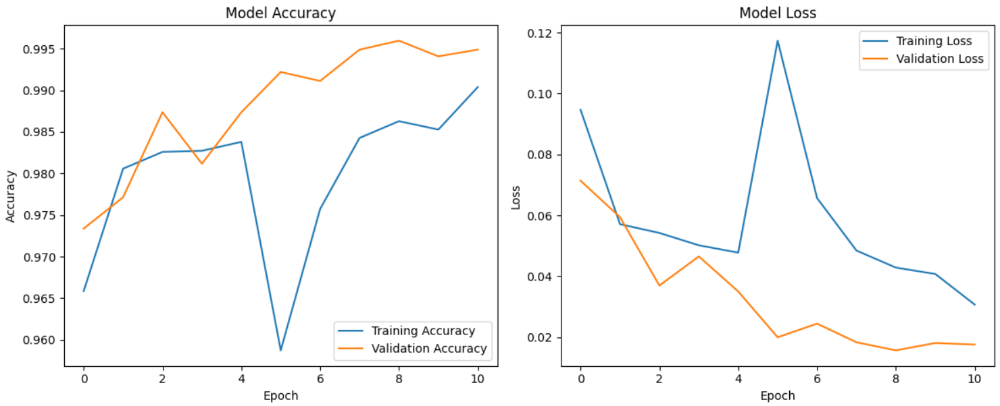

<!DOCTYPE html>
<html lang="en">
<head>
  <meta charset="UTF-8">
  <meta name="viewport" content="width=device-width, initial-scale=1.0">
</head>
<body>

<header>
  <h1>Real-Time Face Mask Detection</h1>
  
 This project implements a real-time face mask detection system using <b>Deep Learning</b> and 
      <b>Transfer Learning (MobileNetV2)</b>. The goal is to classify whether a person is wearing a mask or not, 
      using webcam/video streams as well as static images.  
   I've made it super simple – no local setup, no CUDA and cuDDN, no complicated pip/conda installations. You just need Google Colab + 3 notebooks
 

   

      This project implements a <strong>real-time face mask detection system</strong> 
      using <code>TensorFlow</code>, <code>Keras</code>, and <code>OpenCV</code>. 
      The model classifies whether a person is wearing a mask or not from a live camera feed.
    

   

      The system is trained on a combined dataset of multiple Kaggle datasets (~18k images) to improve accuracy and robustness. 
      The project was developed and tested in <b>Google Colab</b> for easy accessibility and GPU acceleration.
    

</header>

<main>

<section>
    <h2>🚀 Importance</h2>
    <ul>
      <li>Enforcing safety protocols in public places</li>
      <li>Preventing the spread of infectious diseases</li>
      <li>Supporting authorities with low-cost, scalable solutions</li>
    </ul>
  </section>

   <section>
    <h2>📂 Dataset</h2>
    <ul>
      <li>Created by combining multiple Kaggle datasets (Mask / No Mask)</li>
      <li>~18,500 images used</li>
      <li>Preprocessing: resized to 224x224, normalized, and augmented (flips, rotations, zoom)</li>
    </ul>
  </section>

  <h2>📌 Features</h2>
    <ul>
      <li>Real-time face mask detection using webcam</li>
      <li>Trained with MobileNetV2 for high accuracy</li>
      <li>Supports both mask and no-mask classification</li>
      <li>Lightweight and fast for real-time deployment</li>
    </ul>

  <section>
     <h2>🧠 Model (MobileNetV2)</h2>
    
<b>Base Model:</b> Pre-trained MobileNetV2 on ImageNet

    
<b>Custom Layers:</b>

    <ul>
      <li>GlobalAveragePooling2D</li>
      <li>BatchNormalization</li>
      <li>Dropout (0.5 and 0.3)</li>
      <li>Dense (ReLU + Softmax for binary classification)</li>
    </ul>
    
<b>Training Strategy:</b>

    <ul>
      <li>Phase 1: Train top layers with frozen base</li>
      <li>Phase 2: Fine-tune deeper layers with a lower learning rate</li>
    </ul>
    
<b>Optimizations:</b> EarlyStopping, ReduceLROnPlateau, ModelCheckpoint

  </section>

  <section class="section">
    <h2>📂 Project Structure</h2>
    <pre><code>📦 Real Time Face Mask Detection
 ┣ 📜 Face Mask Detection DeepLearning.ipynb
 ┣ 📜 RealTimeDetection.ipynb
 ┣ 📜 Using the trained model.py
 ┣ 📂 dataset
</code></pre>
  </section>

  <section>
    <h2>📊 Training & Performance</h2>
    <ul>
      <li>99.2%+ expected accuracy</li>
      <li>Generalizes across lighting, angles, and quality variations</li>
    </ul>
    <h3>📈 Accuracy & Loss Graphs:</h3>
    

  </section>

  <section>
    <h2>🛠️ Tech Stack</h2>
    <ul>
      <li>Python</li>
      <li>TensorFlow / Keras</li>
      <li>OpenCV</li>
      <li>NumPy / Matplotlib</li>
      <li>Google Colab (GPU training)</li>
    </ul>
  </section>

  <section id="how-to-run">
  <h2>⚙️ How to Run</h2>
    
This repo contains 3 main notebooks:

    <ol>
      <li><b>Model Training:</b> <code>Face Mask Detection DeepLearning.ipynb</code></li>
      <ul>
        <li>Upload dataset (Kaggle or custom)</li>
        <li>Adjust training params (Phase 1 = 10 epochs, Phase 2 = 20 epochs)</li>
        <li>Save model as <code>best_mask_model.h5</code></li>
        <li>Export model to Google Drive</li>
      </ul>
      <li><b>Model Testing:</b> <code>Using the trained model.ipynb</code></li>
      <ul>
        <li>Load saved model</li>
        <li>Upload image + copy path</li>
        <li>Predict Mask / No Mask with confidence score</li>
      </ul>
      <li><b>Real-Time Detection:</b> <code>RealTimeDetection.ipynb</code></li>
      <ul>
        <li>Runs webcam detection in Google Colab</li>
        <li>Detects & labels faces as Mask/No Mask</li>
      </ul>
    </ol>

  

    <strong>Tip:</strong> In Colab set Runtime → Change runtime type → GPU for faster training (optional).
  

</section>

  <section>
    <h2>🤝 Contributions</h2>
    
Contributions, issues, and feature requests are welcome! 
       Feel free to fork this repo and submit a pull request.

  </section>

  <section>
    <h2>📜 License</h2>
    
This project is licensed under the <b>MIT License</b> – free to use and modify.

  </section>

</main>

<footer>
  
Made with ❤️ using TensorFlow & OpenCV

</footer>

</body>
</html>
